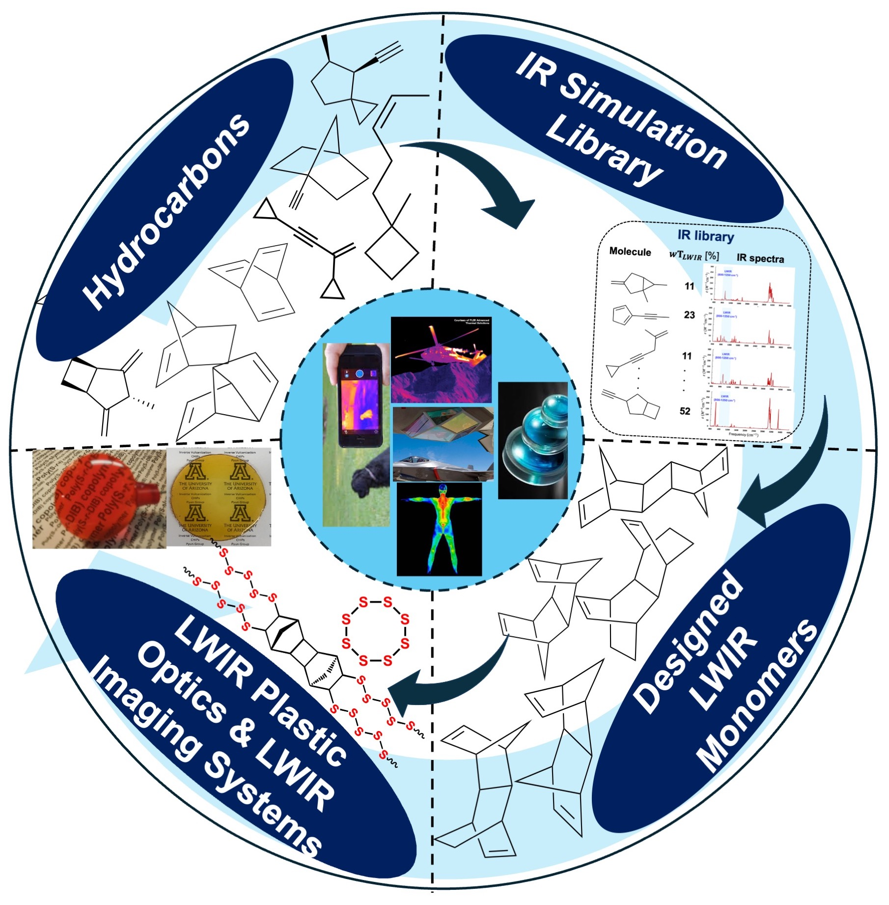

# DMREF_Computational_Screening

### This repository contains parts of the IR data set for the paper 

## [High-throughput Computational Screening of Hydrocarbon Molecules for Long-wavelength Infrared Imaging](https://doi.org/10.1021/acsmaterialslett.4c01037).

**This IR data set is associated with the DMREF project (Computational Chemistry to Accelerate Development of Long Wave Infrared Polymers) in Chemistry and Biochemistry Department at University of Arizona**

**Overview**

  

*Figure: Comonomer design Protocol for organic or sulfur/organic hybrid polymeric materials for
LWIR imaging application*

